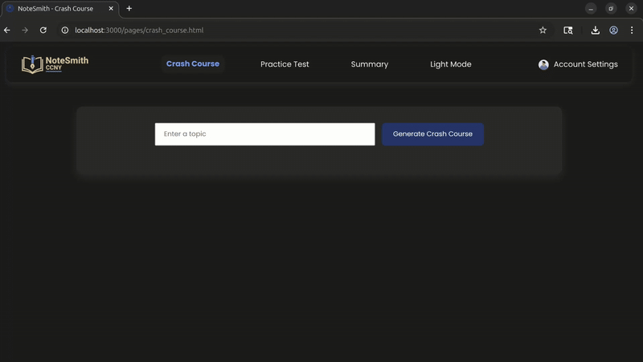
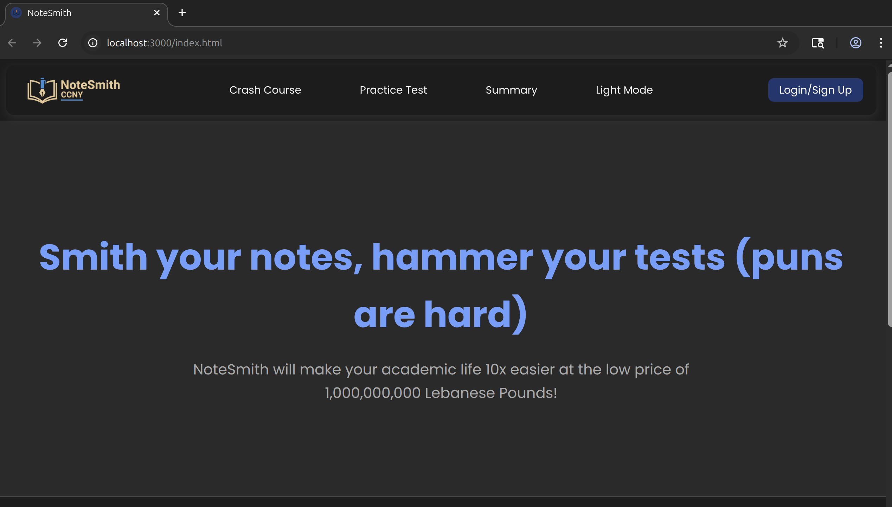
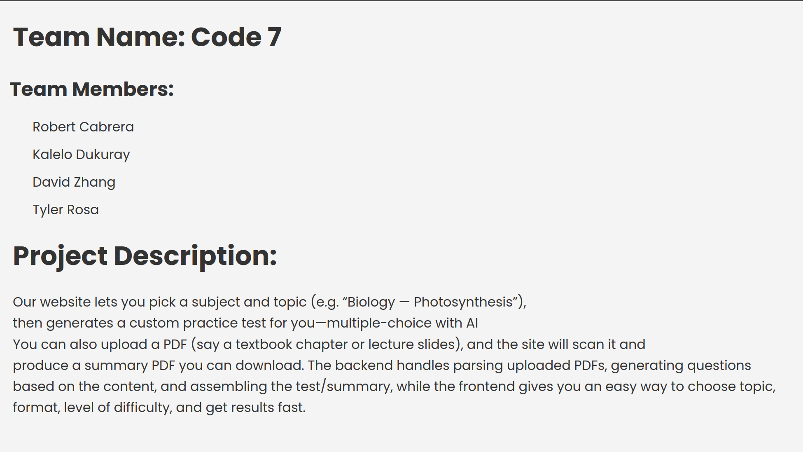

#  Notes and Updates

 ## JS Migration - Oct 12 2025:  
 The `develop` branch transitioned from **static JavaScript** to a **Node.js** runtime to support **Gemini API Integration**, therefore GitHub pages deployment is  **disabled** until further notice. 
  
 To run the local version of the repository, execute:  
 ```bash
 node scripts/server.js
 ```
A Gemini-API key is required, this can be obtained in https://aistudio.google.com/api-keys
  


# Homework Progress

## Continued Backend (HW3) - Oct 12 2025

### Crash course demo: 
> 

### PDF summary demo (small files - page by page):
> 

### PDF summary demo (large files - page ranges):
> 

## Repository Creation and Frontend (HW1 & HW2) - Oct 06 2025

### Front-end navigation: 
> 

### Initial commit: 
> 
