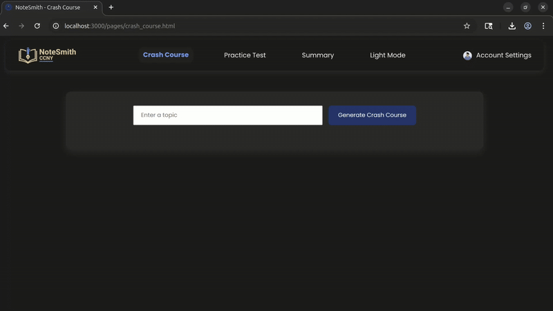
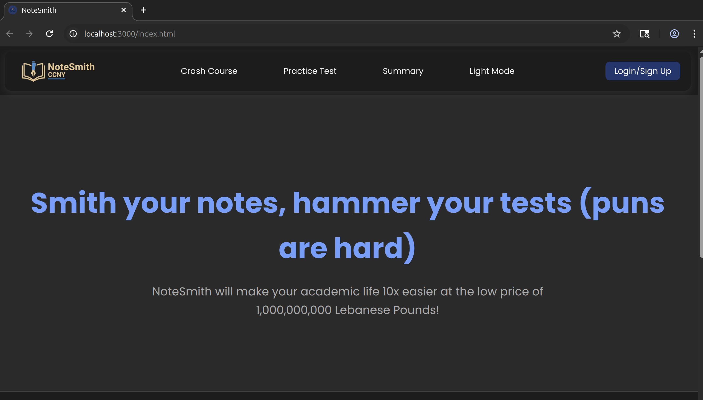
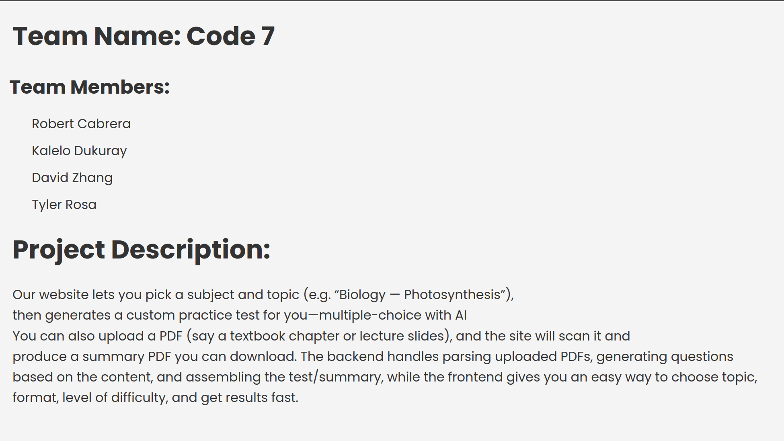

# File Structure

```
csc47300-team-code7/
│
├── frontend/                  # Client-side application files
│   ├── assets/                # Static assets (images, icons, etc.)
│   ├── pages/                 # HTML pages for different features
│   ├── scripts/               # Client-side JavaScript files
│   ├── stylesheets/           # CSS styling files
│   └── index.html             # Main landing page
│
├── backend/                   # Server-side application files
    ├── routes/                # Express route handlers (API endpoints)
    ├── utils/                 # Utility functions (will be helpful when adding database)
    ├── data_objects/          # JSON objects files
    └── server.js              # Express server entry point
```


#  Notes and Updates

 ## Directory Refactoring - Oct 17 2025:
 Separated the files into `frontend/` and `backend/` for better organization, ensuring the biggest directory is the root directory as requested in the last email

 ## JS Migration - Oct 12 2025:  
 The `develop` branch transitioned from **static JavaScript** to a **Node.js** runtime to support **Gemini API Integration**, therefore GitHub pages deployment is  **disabled** until further notice. 
  
 To run the local version of the repository, execute:  
 ```bash
 node scripts/server.js
 ```
A Gemini-API key is required, this can be obtained in https://aistudio.google.com/api-keys
  


# Homework Progress

## Continued Backend (HW3) - Oct 12 2025

### Crash course demo: 
> 

### PDF summary demo (small files - page by page):
> 

### PDF summary demo (large files - page ranges):
> 

## Repository Creation and Frontend (HW1 & HW2) - Oct 06 2025

### Front-end navigation: 
> 

### Initial commit: 
> 
